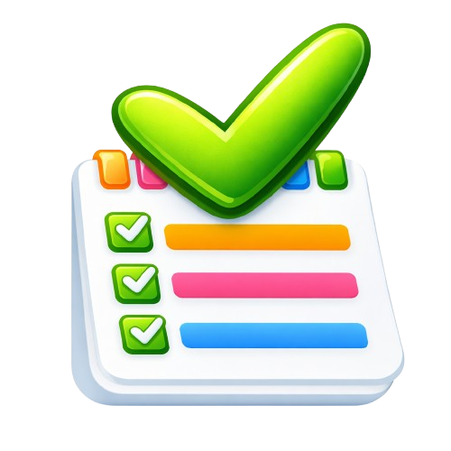
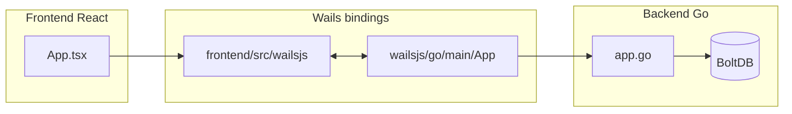

# Desk Tasks




**The lightest desktop app** to manage your daily tasks.

- **Works on all major operating systems**
- **No installation required**
- **No account needed**

Your data stays on your device.
**No overhead. Just execution.**

## Prerequisites

- Go 1.26+
- Node.js 22+
- [Wails CLI](https://wails.io/docs/gettingstarted/installation): `go install github.com/wailsapp/wails/v2/cmd/wails@latest`

## Run Locally

### 1) Verify toolchain

```bash
go version
node --version
npm --version
wails doctor
```

### 2) Install project dependencies

```bash
go mod download
cd frontend && npm install
cd ..
```

### 3) Start development mode

```bash
make dev
```

### 4) Build production binary

```bash
make build
```

Output binary: `build/bin/`

## Useful Make Targets

- `make build-linux-amd64`: Builds Linux AMD64 binary.
- `make build-windows`: Builds Windows AMD64 binary.
- `make build-windows-installer`: Builds Windows installer (NSIS required).
- `make build-macos-universal`: Builds universal macOS app.

## Project Structure

```text
desk-tasks/
├── app.go
├── main.go
├── Makefile
├── go.mod
├── wails.json
├── build/
│   ├── appicon.png
│   ├── darwin/
│   └── windows/
│       ├── icon.ico
│       └── installer/
├── frontend/
│   ├── src/
│   │   ├── components/
│   │   ├── hooks/
│   │   └── wailsjs/
│   └── wailsjs/
```

## Architecture



## CI/CD

A GitHub Actions workflow runs when a GitHub Release is published, syncs VERSION from the release tag, and builds release binaries for Windows, macOS, and Linux. Binaries are automatically attached as release assets.
